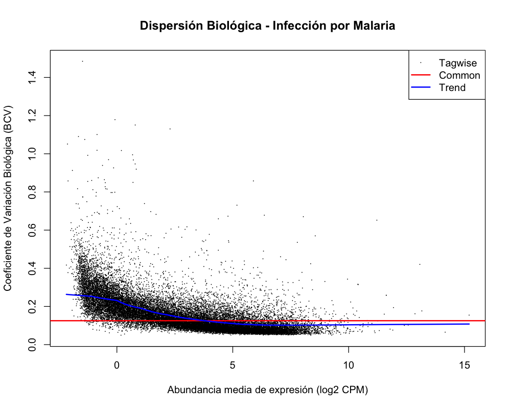
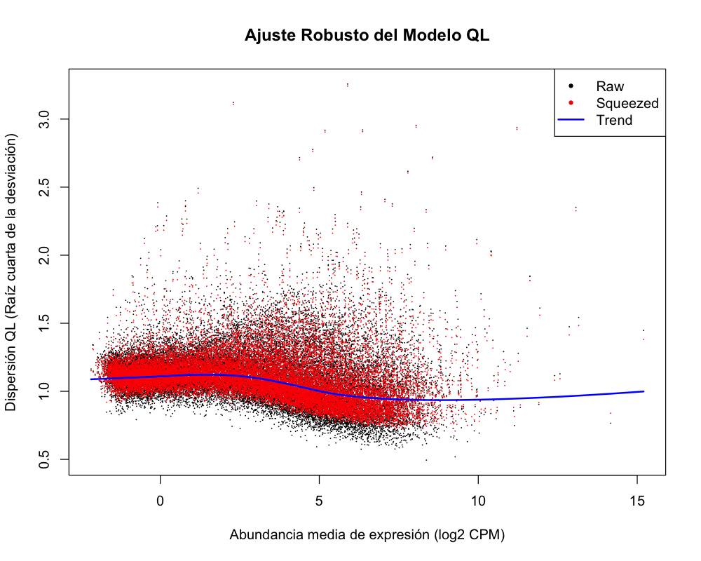
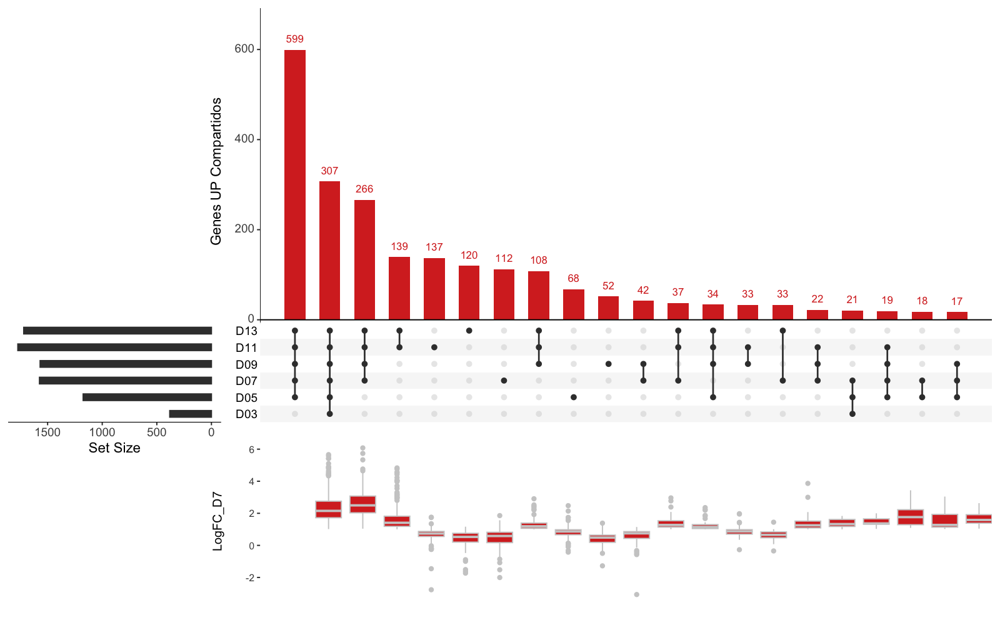
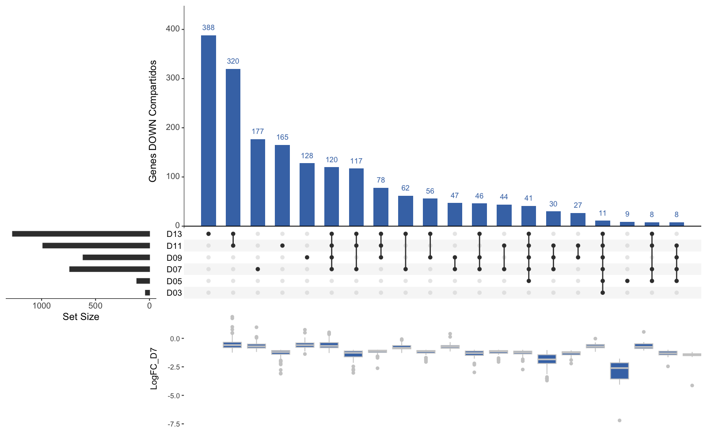
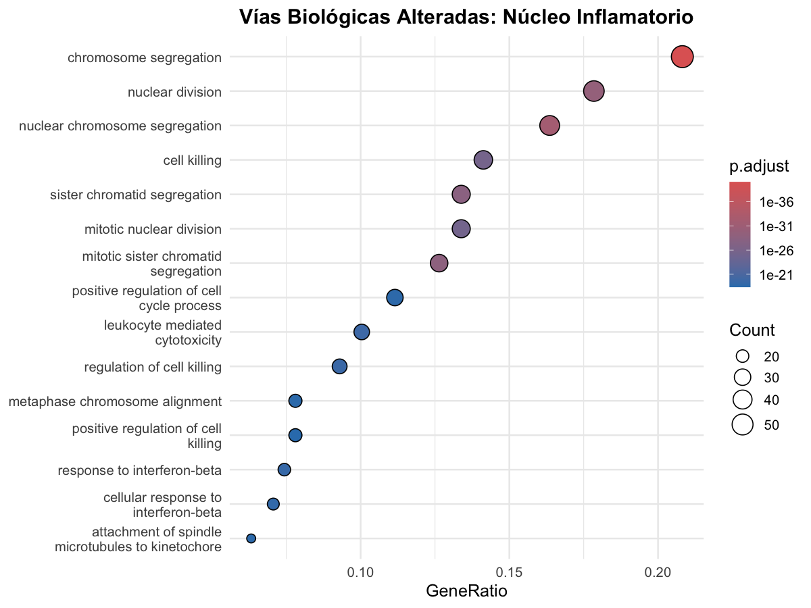
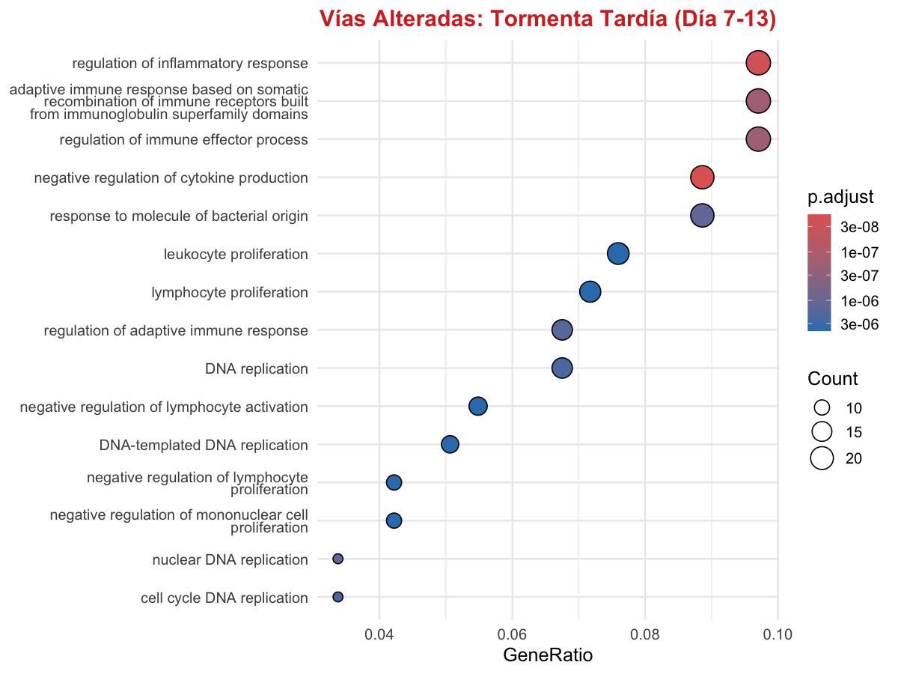

# Dinámica Transcriptómica Temporal en Malaria (GSE279789)

## 📖 Descripción del Proyecto
Este proyecto reproduce y amplía el análisis transcriptómico del tejido pulmonar murino infectado por *Plasmodium chabaudi*, utilizando el dataset público **GSE279789**. 

El objetivo principal es rastrear la evolución temporal de la expresión génica desde la fase temprana de la infección (Día 3) hasta el pico letal de la enfermedad (Día 13), desentrañando la cascada biológica que conduce a la tormenta de citoquinas y al colapso del órgano.

---
## ⚙️ Metodología y Herramientas Analíticas
Para garantizar la robustez estadística y la interpretabilidad biológica, el pipeline se dividió en dos fases:

**Modelado Estadístico (`edgeR`):** Se ajustaron modelos lineales generalizados (GLM) basados en cuasi-verosimilitud (`glmQLFit`) con el parámetro `robust = TRUE` para controlar la alta variabilidad biológica intrínseca a los modelos *in vivo*. Se evaluó la calidad del ajuste mediante gráficos de dispersión biológica (BCV) y QL-Dispersion.

Dada la alta variabilidad intrínseca de los modelos de infección *in vivo*, el control de la dispersión es un paso crítico antes de evaluar la expresión diferencial. 

1. **Variabilidad Biológica (BCV):** El gráfico de dispersión (izquierda) muestra el Coeficiente de Variación Biológica. Como es esperable en tejido pulmonar completo sometido a una infección sistémica, la dispersión general es alta. 
2. **Ajuste de Cuasi-verosimilitud (QL):** Para evitar una tasa elevada de falsos positivos (genes que parecen alterados solo por ruido biológico), se aplicó el modelo estadístico robusto de `edgeR` (derecha). Este método "comprime" las estimaciones de dispersión individuales hacia una tendencia general (línea azul), penalizando los genes con variabilidad anómala.

  
  

 
 **Visualización Compleja y Ontología (`UpSetR` y `clusterProfiler`):** Tradicionalmente, las intersecciones de conjuntos genéticos se han representado mediante diagramas de Venn o Euler. Sin embargo, estas representaciones resultan inadecuadas y difíciles de interpretar cuando se maneja un número elevado de conjuntos experimentales (Conway et al., 2017). Para superar esta limitación geométrica, se implementó el paquete `UpSetR`, empleando una visualización escalable basada en matrices. Esto permitió integrar el *Log2 Fold Change* del pico inflamatorio (Día 7) como diagramas de cajas superpuestos. Finalmente, se mapearon las firmas genéticas a la base de datos *Gene Ontology (GO)*.

---
## 📊 Resultados Clave: La evolución de la patología

### 1. La Respuesta Hiperinflamatoria Tardía (Sobreexpresión)
Al integrar los niveles de expresión (LogFC) del **Día 7** como *atributos* sobre las intersecciones temporales, observamos dos dinámicas clave:
* **El núcleo duro (307 genes):** Se activa en el Día 3 y se mantiene constitutivamente encendido, alcanzando los niveles más extremos de sobreexpresión durante el pico letal. Actúa como el motor destructivo de la enfermedad. 
* **La segunda oleada (599 genes):** Un grupo masivo que se activa a partir del Día 5, sumándose a la carga inflamatoria basal.

### 2. El Colapso Pulmonar (Infraexpresión)
La represión génica (apagado de funciones basales del tejido) es un evento **estrictamente tardío**. Las intersecciones más masivas de genes infraexpresados pertenecen exclusivamente a los Días 9, 11 y 13, demostrando que el pulmón no falla hasta que la infiltración inmunitaria supera un umbral crítico.

### 3. Ontología Génica (Dinámica Inmune)
El Análisis de Enriquecimiento (GO) reveló una clara transición en la fisiología del ratón:
1. **Fase de Expansión (Núcleo D3-D13):** Dominada por vías de proliferación celular y toxicidad mediada por leucocitos. El sistema inmune se multiplica para combatir el parásito.
2. **Fase de Tormenta (Exclusivos D7-D13):** El foco cambia hacia la *regulación de la respuesta inflamatoria* y la *inmunidad adaptativa*, evidenciando el fracaso del organismo para frenar el daño colateral.

  
  

### 4. Discusión y Contraste con la Literatura Original
Este análisis complementa y valida los hallazgos del estudio original de Chen et al. (2026), aportando un enfoque metodológico alternativo centrado en **intersecciones booleanas estrictas** (`UpSetR`):

* **Estrategia Analítica:** Mientras que el estudio original abordó las dinámicas temporales mediante agrupamiento difuso (*soft clustering* con `Mfuzz`) y normalización con `DESeq2`, el pipeline presentado en este proyecto implementó modelos cuasi-verosímiles robustos (`edgeR`) combinados con matrices de atributos (`UpSetR`). Esta aproximación geométrica ha permitido aislar de forma exacta el "núcleo duro" de genes constitutivamente alterados frente a las respuestas tardías, aportando una resolución temporal sólida.

* **Consenso Biológico (El rol del Interferón y las Células T):** El artículo original identifica la señalización de IFN-γ en las células T y su interacción con los monocitos como el motor de la patología pulmonar. Las firmas ontológicas  identificadas en este pipeline respaldan esta hipótesis de manera secuencial:
	1. El núcleo temprano (D3-D13) capturó una firma inequívoca de **toxicidad mediada por leucocitos** y **respuesta a interferón**, mapeando la activación inicial de las células T (ej. *leukocyte mediated cytotoxicity* y *response to interferon-beta*).
	2. La fracción tardía (D7-D13) reveló la transición hacia una **respuesta hiperinflamatoria desregulada** y de inmunidad adaptativa, coincidiendo con el reclutamiento de monocitos proinflamatorios (CD8+ Ly6C+) descrito por los autores como responsable del colapso del órgano (ej. *regulation of inflammatory response* y *adaptive immune response*).
	3. **Validación de Candidatos Clave:** Se desarrolló un script de validación booleana (`03_validacion_candidatos.R`) para rastrear los marcadores específicos mencionados en el estudio original. Los resultados confirmaron la activación constitutiva del **Interferón-gamma (Ifng)** desde el Día 3, y la llegada simultánea de las firmas de **Células T (Cd8a, Cd8b1)** y **Monocitos (Ly6c1/2)** a partir del Día 5, momento exacto en el que se detona la patología tisular:

| Gen | D03 | D05 | D07 | D09 | D11 | D13 | Perfil Biológico |
| :--- | :---: | :---: | :---: | :---: | :---: | :---: | :--- |
| **Ifng** | 1 | 1 | 1 | 1 | 1 | 1 | Señalización proinflamatoria constitutiva |
| **Cd8a** | 0 | 1 | 1 | 1 | 1 | 1 | Marcador de Células T (Inmunidad Adaptativa) |
| **Cd8b1** | 0 | 1 | 1 | 1 | 1 | 1 | Marcador de Células T |
| **Ly6c1** | 0 | 1 | 1 | 0 | 1 | 0 | Monocitos proinflamatorios (Fluctuante) |
| **Ly6c2** | 1 | 1 | 1 | 1 | 1 | 1 | Monocitos proinflamatorios (Constitutivo) |

---

## 💻 Reproducibilidad y Uso del Repositorio

Para garantizar que cualquier investigador pueda replicar este análisis desde cero, el repositorio ha sido estructurado siguiendo estándares estrictos. 

> **Nota sobre los Datos Crudos:** Por restricciones de tamaño en GitHub, la matriz original de conteos no está incluida en este repositorio (se ignora mediante `.gitignore`). Debes descargarla manualmente siguiendo el paso 2.

### Instrucciones paso a paso:

1. **Clonar el repositorio localmente:** `git clone`
2. **Preparar los datos originales (GEO):**
	- Crea una carpera llamada `data/` en el directorio principal del proyecto clonado.
	-  Accede a la base de datos NCBI GEO y descarga la matriz de conteos del proyecto **([GSE279789](https://www.ncbi.nlm.nih.gov/geo/query/acc.cgi?acc=GSE279789))**.
    - Guarda el archivo descargado dentro de la carpeta `data/` con el nombre exacto de `GSE279789_raw_counts.txt`.
3. **Configurar el entorno (RStudio).*:
    - Abre los scripts en RStudio.
    - Es **imprescindible** establecer la carpeta `code/` como tu Directorio de Trabajo para que las rutas relativas funcionen correctamente. Puedes hacerlo desde el menú superior: _Session > Set Working Directory > To Source File Location_.

4. **Ejecutar el Pipeline Analítico:** Lanza los scripts secuencialmente:
    
    - `00_instalar_dependencias.R`: Escanea tu sistema e instala automáticamente los paquetes de CRAN y Bioconductor necesarios.
        
    - `01_analisis_temporal_malaria.R`: Procesa los datos crudos, ajusta el modelo estadístico robusto (`edgeR`) y exporta las listas de genes.
        
    - `02_analisis_avanzado_y_ontologia.R`: Construye las matrices booleanas, genera las visualizaciones `UpSetR` y ejecuta el análisis de ontología (`clusterProfiler`).
        
    - `03_validacion_candidatos.R`: Script de validación para rastrear las firmas de Interferón y fenotipos T/Monocitos descritos en la literatura.

---
## 📚 Referencias y Bibliografía
Este análisis se apoya en el desarrollo metodológico de las siguientes herramientas y publicaciones:
* **UpSetR:** Conway, J. R., Lex, A., & Gehlenborg, N. (2017). UpSetR: an R package for the visualization of intersecting sets and their properties. *Bioinformatics*, 33(18), 2938-2940.
* **clusterProfiler:** Yu, G., Wang, L. G., Han, Y., & He, Q. Y. (2012). clusterProfiler: an R package for comparing biological themes among gene clusters. *OMICS: A Journal of Integrative Biology*, 16(5), 284-287.
* **edgeR:** Robinson, M. D., McCarthy, D. J., & Smyth, G. K. (2010). edgeR: a Bioconductor package for differential expression analysis of digital gene expression data. *Bioinformatics*, 26(1), 139-140.
* **Datos Originales (Malaria):** Chen, S. S., Yang, Q., Zhong, Y., Liu, D., Zhou, L., Wei, H. C., ... & Lin, J. W. (2026). Comprehensive immune profiling reveals IFN-γ signaling in T cells mediates parasite phagocytosis in a rodent malaria model. _Mbio_, 17(4), e03938-25.
